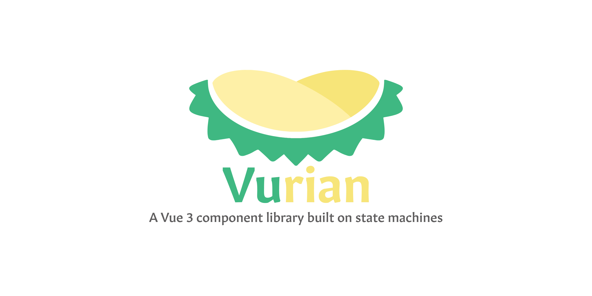

<h1 align="center">@vurian/wizard - A wizard machine component for Vue 3</h1>

<!-- badge -->
[](https://app.netlify.com/sites/vurianjs/deploys)
[](https://www.npmjs.com/package/@vurian/wizard)
[](https://www.npmjs.com/package/@vurian/wizard)
<!-- endbadge -->



The more organized and out-of-the-box for Wizard Component from the Vurian project, written in TypeScript and using [XState](https://xstate.js.org).

📚 Documentation: [https://vurianjs.netlify.app](https://vurianjs.netlify.app)

🎮 Playground: TBD

💻 Demo: TBD

## Example

An example of how to define and use the component as shown below:

## 1. Define the data context for the Wizard

In the `script` we will need to define the wizard context, with any data related to the general flow of the wizard per need. However, you need to initialize at least 2 fields: `completedSteps` and `currentView`

In the example below we define a wizard with `shipping`, `paymentMethod`, `cart`, `shippingMethod`, `billing` and a flag for `agreeToTerms` as the common data needed for a checkout wizard.

```vue
<script setup>

const context = {
  completedSteps: [],
  cart: [],
  shipping: {
    address: '',
    phone: '',
    email: '',
    id: ''
  },
  shippingMethod: '',
  billing: {
    address: '',
  },
  agreeToTerms: false,
  paymentMethod: ''
}

</script>
```

## 2. Define the steps (or states) of the Wizard

Now let's pass the configuration of the steps (or states) for the wizard to handle. For each step, it's essential to provide the following:

* `id` - id of the state.
* `title` - title of the state to display on the progress flow in the wizard header.
* `stepView` - this is the component to render for the relevant state.
* `order` - order of appearance of the state in the flow. This will be used to initialize which state to go next/prev.

The `states` is an object contains all the steps needed, following the above format, as seen below:

```js
const states = {
  review: {
    title: 'Review',
      id: 'review',
      stepView: ReviewCart,
      order: 0,
      meta: {
        description: 'Review your cart',
      },
  }
}
```

If you wish to add internal events such as updating shipping address, payment method, etc, you can create your own events by using the property `on`. However, to handle updating any context data of the wizard will require using `assign` function from `xstate`.

Below is the example of the configuration for step/state `shipping` in `states`

```js
const states = {
  /*...*/
  shipping: {
    title: 'Shipping',
    id: 'shipping',
    stepView: Shipping,
    order: 1,
    on: {
      //event to update address to be triggered inside Shipping component
      UPDATE_ADDRESS: {
        actions: assign({
          shipping: (_, event) =>  event.address
        }),
        meta: {
          description: 'Provide shipping address'
        }
      },
      //event to update shipping method to be triggered inside Shipping component
      SELECT_METHOD: {
        actions: assign({
          shippingMethod: (_, event) => event.method 
        }),
        meta: {
          description: 'Select shipping method'
        }
      },
    },
  },
}
```

<alert type='info'>

If it is the final step, and you don't wish to enable the prev button, you can set `state.type` to `final`.

</alert>

By default next/prev is handled automatically without being defined in the state configuration. However, in certain case you wish to add condition to enable/disable the next/prev functionality (as a step guard), such as in payment it is a must to complete the payment method and agreeing to the T&C. 

In this scenario you can use `on.NEXT.cond` and define the method to trigger for validation. 

```js
const states = {
  /*...*/
  payment: {
    title: 'Payment',
    id: 'payment',
    stepView: Payment,
    order: 3,
    on: {
      /*...*/
      NEXT: {
        cond: 'isAgreeToTerm'
      }
    }
  },
}
```

The actual method implementation should be provide in step 3 below - define options.

## 3. Define additional options (validation per step, etc)

Options are the external configurations to setup for the wizard, based on [Xstate options](https://xstate.js.org/docs/guides/machines.html#options). It can receive `guards`, `actions`, `delays`, `activities`, and `services`.

In our example we will set the guard validation for `NEXT` event in Payment Step.

```js
const options= {
  guards: {
    isAgreeToTerm: (ctx) => ctx.agreeToTerms && !!ctx.paymentMethod,
  }
}
```

Upon user reaches to Payment step, the Next button will be disabled until user fulfills all the inputs required (`agreedToTerms` and `paymentMethod`). Out of the box!

## 4. Add `onComplete` event listener

We can also pass an event handler to the wizard to trigger when all the steps is completed.

```js
const onComplete = async() => {
  //redirecting to home page
}
```

## 5. Define the wizard's id and initial step

Two last configuration props we need to initialize is `id` and `initial` as `id` is required to create wizard state machine, and `initial` defines the first step for the wizard to start from. 

`initial` can be the key of the state defined in `states`, or the `id` of that state.

```js
const id = "checkout"
const initial = "review", //start with the review step
```

## 6. Bind to `VrWizard` component

And finally, we need to pass those variables to the `VrWizard` component.

```vue
<template>
  <VrWizard 
    :options="options" 
    :id="id" 
    :context="context" 
    :states="states" 
    :initial="initial"
    :onComplete="onComplete"
    title="My Vurian Checkout Wizard"
    description="Just checking out"
  />
</template>
```

And the full code will look something similar to the below code:

```vue
<script setup>
import VrWizard from '@vurian/wizard';
import ReviewCart from './components/Steps/ReviewCart.vue';
import Payment from './components/Steps/Payment.vue';
import Confirmation from './components/Steps/Confirmation.vue';
import Shipping from './components/Steps/Shipping.vue';
import Billing from './components/Steps/Billing.vue';
import { assign } from "xstate";

const config = {
  id: "checkout",
  initial: "review",
  context: {
    completedSteps: [],
    cart: [],
    shipping: {
      address: '',
      phone: '',
      email: '',
      id: ''
    },
    shippingMethod: '',
    billing: {
      address: '',
    },
    agreeToTerms: false,
    paymentMethod: ''
  },
  states: {
    review: {
      title: 'Review',
      id: 'review',
      meta: {
        description: 'Review your cart',
      },
      stepView: ReviewCart,
      order: 0,
    },
    shipping: {
      title: 'Shipping',
      id: 'shipping',
      stepView: Shipping,
      order: 1,
      on: {
        UPDATE_ADDRESS: {
          actions: assign({
            shipping: (_, event) =>  event.address
          }),
          meta: {
            description: 'Provide shipping address'
          }
        },
        SELECT_METHOD: {
          actions: assign({
            shippingMethod: (_, event) => event.method 
          }),
          meta: {
            description: 'Select shipping method'
          }
        },
      },
      meta: {
        description: 'Shipping address',
      }
    },
    billing: {
      title: 'Billing',
      id: 'billing',
      stepView: Billing,
      order: 2,
      on: {
        ADD_BILLING_ADDRESS: {
          meta: {
            description: 'Enter billing address'
          },
          actions: assign({
            billing: (context, event) =>  ({
              ...context.billing,
              address: event.address
            })
          }),
        },
      },
      meta: {
        description: 'Billing address',
      }
    },
    payment: {
      title: 'Payment',
      id: 'payment',
      stepView: Payment,
      order: 3,
      on: {
        SELECT_METHOD: {
          meta: {
            description: 'Select a payment method'
          },
          actions: assign({
            paymentMethod: (_, event) => event.paymentMethod
          })
        },
        AGREE_TO_TERM: {
          meta: {
            description: 'Confirm agree to terms & conditions'
          },
          actions: assign({
            agreeToTerms: (_, event) => event.agreeToTerms
          })
        },
        NEXT: {
          cond: 'isAgreeToTerm'
        }
      },
      meta: {
        description: 'Payment',
      },
    },
    success: {
      title: 'Confirmation',
      id: 'success',
      stepView: Confirmation,
      order: 4,
      meta: {
        description: 'Order confirmed',
      },
    },
  },
} 

const options = {
  guards: {
    isAgreeToTerm: (ctx) => ctx.agreeToTerms && !!ctx.paymentMethod,
  }
}

const onComplete = () => {
    /* do something */
}
</script>
<template>
  <VrWizard 
    :options="options" 
    :id="config.id" 
    :context="config.context" 
    :states="config.states" 
    :initial="config.initial"
    :onComplete="onComplete"
    title="My Vurian Checkout Wizard"
    description="Just checking out"
  />
</template>
```

## Result


A video will come soon.

## Visualize the wizard's flows

You can also visualize your steps by using [the visualizer from Stately](https://stately.ai/viz) (just need to define the next/prev yourself). There is plan for component visualizer to be coming soon :)!

Our example wizard's flows above can be visualized as below:


